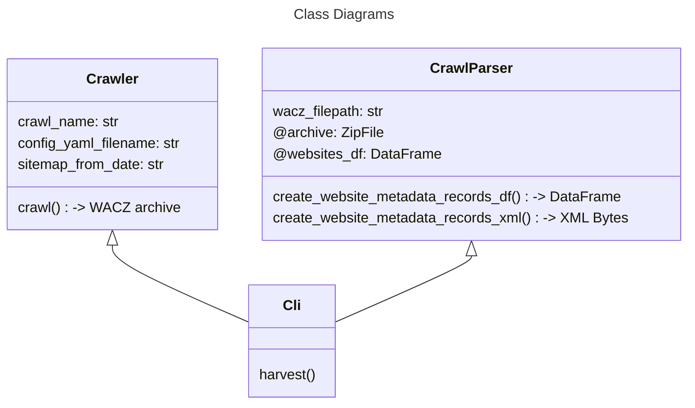
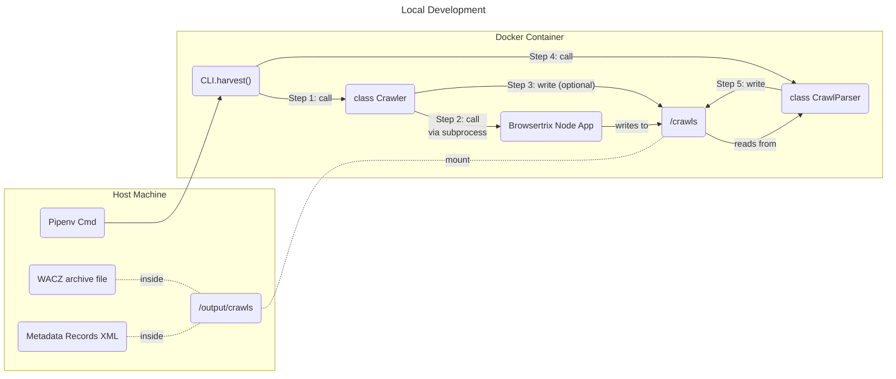
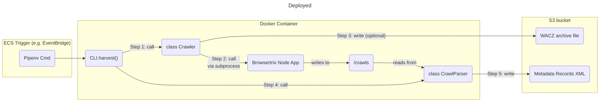

# browsertrix-harvester architecture

## Code Architecture

```mermaid
---
title: Class Diagrams
---
classDiagram
    class Cli{
        harvest()        
    }
    class Crawler{
        crawl_name: str
        config_yaml_filename: str
        sitemap_from_date: str         
        crawl() -> WACZ archive
    }
    class CrawlParser{
        wacz_filepath: str
        @archive: ZipFile
        @websites_df: DataFrame
        create_website_metadata_records_df() -> DataFrame
        create_website_metadata_records_xml() -> XML Bytes
        
    }
    Crawler <|-- Cli
    CrawlParser <|-- Cli
    
```

## Flow Diagrams

### Local Development

```mermaid
---
title: Local Development
---
flowchart LR
    
    %% host machine
    pipenv_cmd("Pipenv Cmd")
    output_folder("/output/crawls")
    
    %% docker container
    cli_harvest("CLI.harvest()")
    crawler("class Crawler")
    parser("class CrawlParser")
    crawls_folder("/crawls")
    btrix("Browsertrix Node App")
    
    %% anywhere
    output_wacz("WACZ archive file")
    output_metadata("Metadata Records XML")
    
    
    pipenv_cmd --> cli_harvest
    output_folder -. mount .- crawls_folder
    
    subgraph Host Machine
        pipenv_cmd
        output_folder
        output_wacz
        output_metadata
        
        output_wacz -. inside .- output_folder
        output_metadata -. inside .- output_folder
    end
    
    subgraph Docker Container 
        btrix
        crawls_folder
        cli_harvest -->|Step 1: call| crawler
        crawler -->|Step 2: call\nvia subprocess| btrix        
        btrix -->|writes to| crawls_folder
        cli_harvest -->|Step 4: call| parser
        crawls_folder -->|reads from| parser
    end
    
    crawler -->|"Step 3: write (optional)"| crawls_folder
    parser -->|Step 5: write| crawls_folder
    
```

### Deployed

```mermaid
---
title: Deployed
---
flowchart LR
    
    %% host machine
    pipenv_cmd("Pipenv Cmd")
    
    %% docker container
    cli_harvest("CLI.harvest()")
    crawler("class Crawler")
    parser("class CrawlParser")
    crawls_folder("/crawls")
    btrix("Browsertrix Node App")
    
    %% anywhere
    output_wacz("WACZ archive file")
    output_metadata("Metadata Records XML")
    
    
    pipenv_cmd --> cli_harvest
    
    subgraph "ECS Trigger (e.g. EventBridge)" 
        pipenv_cmd
    end
    
    subgraph Docker Container 
        btrix
        crawls_folder
        cli_harvest -->|Step 1: call| crawler
        crawler -->|Step 2: call\nvia subprocess| btrix        
        btrix -->|writes to| crawls_folder
        cli_harvest -->|Step 4: call| parser
        crawls_folder -->|reads from| parser
    end
    
    crawler -->|"Step 3: write (optional)"| output_wacz
    parser -->|Step 5: write| output_metadata
    
    subgraph S3 bucket
        output_wacz
        output_metadata
    end
    
```