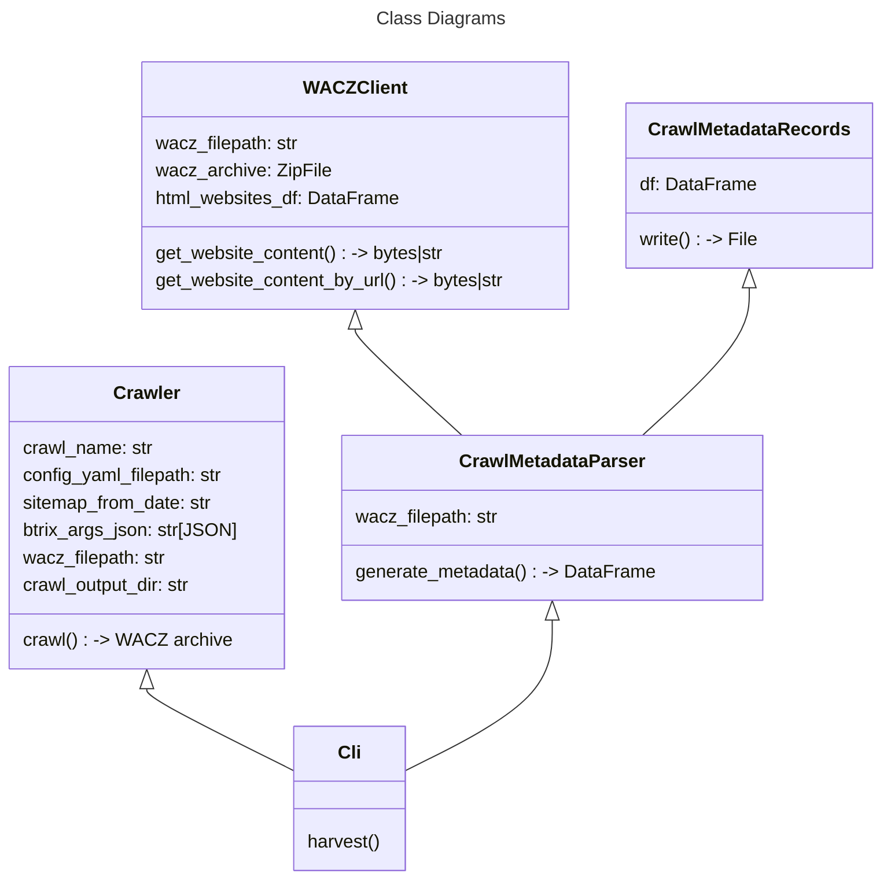
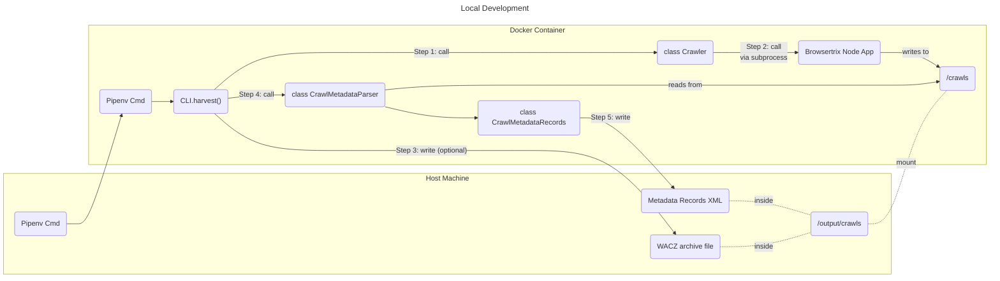
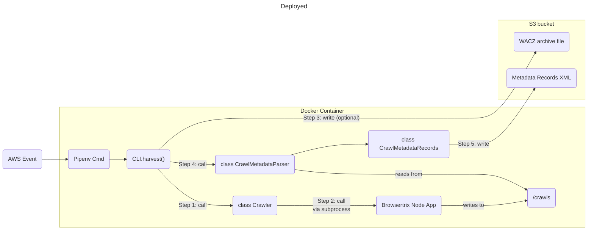

# browsertrix-harvester architecture

This CLI application extends [Browsertrix-Crawler](https://github.com/webrecorder/browsertrix-crawler) as the base docker image, providing an Ubuntu container that has both the somewhat complex browsertrix-crawler installed and configured, and a Pipenv virtual environment for the CLI app that is exposed for use.

```dockerfile
# extend the browsertrix-crawler docker image
FROM webrecorder/browsertrix-crawler:latest
# ...
# ...
```

NOTE: this is different from other python CLI apps, which generally use `python:3.11-slim` as the base image.

## Web Crawls

Any actions that trigger a browsertrix web crawl will not work outside of a container context.  A decorator `harvester.utils.require_container` has been created that can be used to decorate functions or methods that should not run outside of a container context.  This decorator looks for EITHER of the following conditions to be true:
  * the file `/.dockerenv` exists; indicates locally running container
  * the env var `AWS_EXECUTION_ENV` is set; indicates Fargate ECS task

At this time, only the method `Crawler.crawl` has this treatment.

## Code Architecture



## Flow Diagrams

### Local Development


### Deployed

